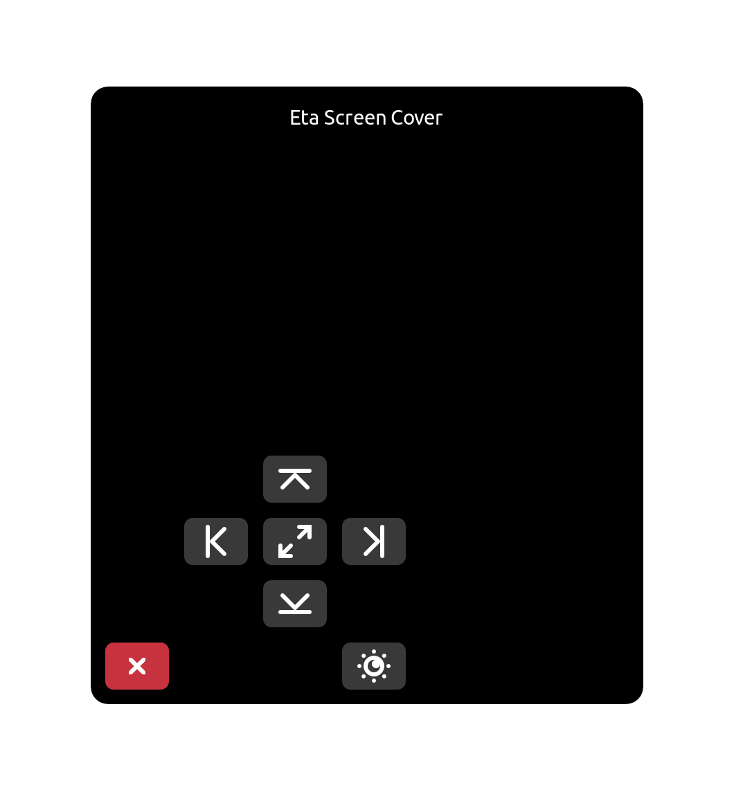

# ETA Screen Cover

ETA Screen Cover is an application that covers specific part of the screen for educational purposes.

[](https://repology.org/project/eta-screen-cover/versions)

### **Dependencies**

This application is developed based on Python3 and GTK+ 3. Dependencies:
```bash
gir1.2-glib-2.0 gir1.2-gtk-3.0
```

### **Run Application from Source**

Install dependencies
```bash
sudo apt install gir1.2-glib-2.0 gir1.2-gtk-3.0
```

Clone the repository
```bash
git clone https://github.com/pardus/eta-screen-cover.git ~/eta-screen-cover
```

Run application
```bash
python3 ~/eta-screen-cover/src/Main.py
```

### **Build deb package**

```bash
sudo apt install devscripts git-buildpackage
sudo mk-build-deps -ir
gbp buildpackage --git-export-dir=/tmp/build/eta-screen-cover -us -uc
```

### **Screenshots**


